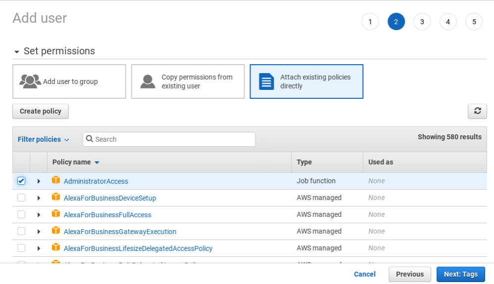

# Cloud Native AWS Development On A Chromebook Using VS Code

Whew!  That's a lot to unpack there.  Let's start in the middle, with the Chromebook,  They're not widely known as development machines.  They are limited in RAM, persistent storage and processor speed.  The OS has limited application support, especially for ones which rely on arbitray code execution like most IDEs.  They have great battery life, small size, and are usually easy to procure (exept in the current return to school COVID shortage).

The newer Chromebooks (see https://sites.google.com/a/chromium.org/dev/chromium-os/chrome-os-systems-supporting-linux for a list of supported devices) have an interesting beta feature--the ability to install a Linux virtual machine.  Termed Crostini, this is a supported way to install a Linux distro (Debian stretch).  This opens up all kinds of possibilities, especially since the user's home folder of the VM is mounted as local storage in the Chrome OS.

Microsoft's VS Code is a fantastic free cross-platform code editor, and can be installed via the Linux command line.  Not to give away any spoilers, but VS Code (and its extensions) runs seamlessly as if it is a native application even though it's installed in the Linux VM.  There is a rich ecosystem of extensions, a few of which will be useful for us.

Ckoud native development is more like infrstructure configuration and control; the definition is closer to "we're connecting and orchestrating AWS's services, rather than coding everything from scratch".  This is why you sometimes hear the term "infrastructure as code" (IAC)--we use a configuration language to write instructions to direct the activities of AWS's services, then deploy the instructions to the service, and test our IAC.  This works in our favor because we can write the code locally and deploy the code via AWS's command line interface.  Fortunately, the AWS CLI tooling can also be installed and run on the Linux VM, giving us a way to deploy our code from a Chromebook.  AWS's infrastructure language is defined using Cloud Formation, and VS Code has several Cloud Formation extensions, including a template library, to facilitate our work.  When a custom coded application is needed, the serverless application model is used (the SAM pattern characteristics are small services with an API interface written in a cross-platform language and deployed in a container).

It's sounding more promising that we can use a Chromebook for AWS development, doesn't it?  One last thing you'll need--an AWS account, so get one if you don't have one already.  There is a free-tier, and everything I'll be doing will use services or service limits which should be "free forever".

Here's how I set up my development environment.  By the way--we'll be using the Linux command line interface (CLI), which I am still learning also.  If you're not familiar, I've found this book to be invaluable: http://linuxcommand.org/.

1. Install Crostini

The Crostini beta makes this step as simple as enabling the feature and waiting for several minutes.  At this time, the VM is loaded on the main drive and consumes a lot of space, so depending on what else you want to do on your machne, you may need to minimize the number of other things you install or save on the main drive.

The installation instructions are at https://support.google.com/chromebook/answer/9145439?hl=en.  Make sure you read the entire page, since there is important information beyond just installation.

After you're done, make sure to open the Terminal and run "sudo apt-get update" and "sudo apt-get upgrade" to make sure you have the latest patches.

2. Install VS Code

Here we are in the CLI!  Microsoft's instructions can be found at https://code.visualstudio.com/docs/setup/linux#_debian-and-ubuntu-based-distributions.  Crostini is a newer Debian-based distro so it's only a couple simple steps.

3. Add CloudFormation Extensions

A moment of truth!  Open VS Code, and if it runs, great job!  Now it's time for an extension to make our development easier, the CloudFormation extension, https://marketplace.visualstudio.com/items?itemName=aws-scripting-guy.cform.

CloudFormation instructions are called stacks (plural: stackset), and can be written in either JSON or YAML.  Stacks are also difficult to write from scratch correctly.  The templates in this extension will make our lives much, much easier.

4. Install and Configure the AWS CLI v2 for Linux x86

AWS provides us a couple ways to administer its services.  You can interact via the web-based console but ultimately we want to get to a higher degree of repeatability and automation in our deployment processes, and the CLI gets us a little closer.  Installation instructions are at https://docs.aws.amazon.com/cli/latest/userguide/install-cliv2-linux.html, and configuration is the next section.

Once installation is complete, you can open the Terminal and run "aws --version".  If that works, you're good to go with configuration.  The most important configuration is the access keys the CLI will use to connect to AWS service APIs.  Although you can use your root user login, it's not a good idea.  Instead, you should create a new IAM user for the CLI.  This is done in the AWS console, and there are a lot of steps in creating a new IAM user, but you can't really screw anything up.  Worst case, delete the user and start over.  In step 2 of the wizard (image below) you're asked to put the new user in a group or attach directly to an IAM profile.  For now, it will be easiest if you attach directly to the AdministrativeAccess profile. We can always titrate this down later, but there are 580+ profiles to sort through and we don't know which ones we need yet.

Once your new IAM user is created, you'll need to follow the configuration for credential file settings at https://docs.aws.amazon.com/cli/latest/userguide/cli-configure-files.html.  That's all we need for now.

5. Install git

Source control is always a best practice.  VS Code, the extensions and the SDKs are all cross platform, so if you install the Windows or Mac bits on another machine, you can easily transfer your code from machine to machine with version history and backup.

Assitionally, we can also use GitHub Actions to deploy our code, but that's for a future post.  I plan to start with the CLI.

Installation for Linuz is found at https://git-scm.com/download/linux.

Notes:

The crouton project can be used to install Ubuntu side-by-side with Chrome OS (see https://ubuntu.com/tutorials/install-ubuntu-on-chromebook#1-overview) but this is not a supported installtion.  It would provide a more native Linux experience, though.

Deeper info about Crostini at https://chromium.googlesource.com/chromiumos/docs/+/master/containers_and_vms.md

Feedback?  Find me on Twitter at @rj_dudley.