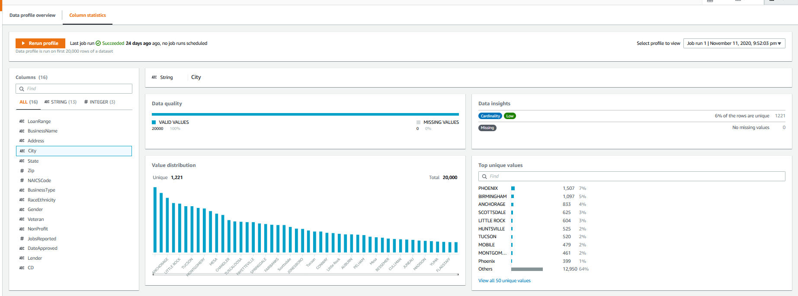

# First Look: AWS Glue DataBrew

## Introduction

This is a post about a new vendor service which blew up a blog series I had planned, and I'm not mad.  With a greater reliance on data science comes a greater emphasis on data engineering, and I had planned a blog series about building a pipeline with AWS services.  That all changed when AWS released DataBrew, which is a managed data profiling and preparation service.  The announcement is at [https://aws.amazon.com/blogs/aws/announcing-aws-glue-databrew-a-visual-data-preparation-tool-that-helps-you-clean-and-normalize-data-faster/](https://aws.amazon.com/blogs/aws/announcing-aws-glue-databrew-a-visual-data-preparation-tool-that-helps-you-clean-and-normalize-data-faster/), but the main thing to know is that DataBrew is a visual tool for analyzing and preparing datasets.  It's powerful without a lot of programming. Despite its ease of use and numerous capabilities, DataBrew will not replace data engineers; instead, DataBrew will make it easier to set up and perform a great deal of the simple, rote data preparation activities, freeing data engineers to focus on the really hard problems.  We'll look into use cases and capabilities in future blog posts.  Spoiler alert: we're still going to need that pipeline I was going to write about, just more streamlined.  Updated series in future posts.

DataBrew is not a stand-alone component, but is instead a component of AWS Glue.  This makes sense, since it adds a lot of missing capabilities into Glue, but can also take advantage of Glue's job scheduling and workflows.  Some of what I was planning to write involved Glue anyway, so this is convenient for me.

In this "First Look" post I'm working my way through the DataBrew screens as you first encounter them, so if you have an AWS account, it might be useful to open DataBrew and move through the screens as you read.  No worries if you don't, I'll cover features more in-depth as I work through future posts. 

## DataBrew Overview

There are four main parts of DataBrew: Datasets, Projects, Recipes and Jobs.  These are just where we start, there is a lot of ground to cover.

### Datasets

DataBrew can work directly with files stored in S3, or via the Glue catalog to access data in S3, RedShift or RDS.  If you're using Lake Formation, it appears DataBrew (since it is part of Glue) will honor the AuthN ("authorization") configuration.  Exactly how this works is a topic for future exploration.

If you're connecting directly to S3, DataBrew can work with CSV, parquet, and JSON files.  At the time of writing, XML is not supported so you'd need to do a conversion upstream in a Lambda or Spark job.  One cool feature is the ability to create parameterized paths to S3, even using a regex.  This isn't something available in the Glue Catalog, only directly to S3.  I work with a lot of files which have a date stamp as part of the filename, so this will be helpful.

### Projects

Holey moley there's a lot of stuff here!  The Projects screen is where the real action is, and we'll spend a lot of time here in the future.

#### Sample View

As we explore the Sample View, it's important to keep in mind that DataBrew is meant for actual data preparation work, not just lightweight profiles.  This sample view is kept to a small windows so we can explore the effects of transformations and monitor effects on quality.

The majority of this page is taken up with a sample of the dataset and some lightweight profiling, including the type, number of unique values in the sample, the most common values in the sample, and the first few rows of the sample.  The sample size and position in the set can be changed.  This sample view is a great way to test transformations and enrichments, which we'll look into later.

The profile view can be changed to explore the schema, which will be inferred from CSV and JSON files, or use the metadata in parquet or Glue Catalog.

he third profile view is correlations and summaries.  If you've runs several profiles, the history is available to browse.  The "missing cells" statistic is something we will revisit for the dataset I have loaded here.  Also, for my sample dataset, the Correlation isn't that interesting because the majority of the columns are part of an address so they should correlate.  But in other datasets, this could be really interesting.

The profile view also has data insights into individual columns, showing several quality metrics for the selected column.

#### Transformations

DataBrew currently has over 250 built-in transformations, which AWS confusingly calls "[Recipe actions](https://docs.aws.amazon.com/databrew/latest/dg/recipe-actions-reference.html)" in parts of its documentation.

The transformations are categorized in the menu bar above the profile grid.  Transformations include removing invalid values, remove nulls, flag column, replace values, joins, aggregates, splits, etc.  Most of these should be familiar to a data professional.  With a join you can enrich one dataset by joining to other datasets.

### Recipes

When we're in the Projects tab, and we apply a transformation to a column, we're creating a recipe step.  One or more recipe steps form a recipe, and there isn't a published maximum number of recipes per dataset.  Since each recipe can be called by a separate job, this provides a great deal of flexibility in our data prep processes.  Recipe steps can only be edited on the Projects tab; the Recipes tab lists the existing recipes, allows for downloading of recipes and some other administrative tasks.  Recipes can be downloaded and published via CloudFront or the CLI, providing a rudimentary sharing ability across datasets.

Opening a recipe brings up summaries of the recipe's versions, and the other tab on this page opens up the data lineage for the recipe.  This lineage is not the data lineage through your enterprise, just the pathway through the recipe.  My simple example here isn't that impressive, but if you build a more complex flow with joins to other datasets and more recipes, this will be a nice view.  Although you can preview the datasets and recipes at the various steps, this is not a graphical workflow editor.

This is also a convenient screen to access CloudTrail logs for the recipes

### Jobs

There are two types of jobs in DataBrew--"recipe" and "profile". 

A profile job examines up to 20,000 rows of data (more if you request an increase).  The results of a profiling job include:
* data type
* unique values count
* missing values count
* most common values and occurrences
* minimum and maximum values with occurrences
* percentiles, means, standard deviation, median
* and more...

One feature missing in the Profiling is determining the pattern or length of text values.  The Profiling results are saved in JSON format, can be saved in S3, and there is an option to create a QuickSight dataset for reporting.  Anything more than QuickSight will require some custom processing of the JSON output. Although it took this long in a blog post to discuss profiling jobs, a profile is something which really should be created before building recipes.

A recipe job configures a published recipe to be run against a selected dataset.  In a Dataset job we choose the dataset, recipe and recipe version we want to use.

The other recipe job option is is a Project job, which uses a saved project defined on the Projects tab.  In this job, the only thing we need to configure is the project.

The original dataset is not modified in DataBrew; instead, we configure the S3 location, output file format, and compression for storing the results.

 

The output can be partitioned on a particuar column, and we can choose whether to overrite the files from the previous run or keep each run's files.  Please use encryption.

Once configured, jobs can be scheduled.  You can have a maximum of two schedules per job.  If you need more than two schedules you'll need to create an identical job.

Either type of job can be run on a schedule, on-demand or as part of other workflows (see "Jobs Integrations" below).  There is only one recipe and one dataset per job, so processing multiple recipes and/or multiple datasets would require additional workflow.

### Jobs Integrations

Aside from the console or a schedule, how else can a DataBrew job be started?  For starters, the DataBrew API exposes all the functionality in the console, including running a job.  When coupled with lambdas, this exposes a great amount of flexibility in starting a job.

A second option is to use a Jupyter notebook (vanilla Jupyter, not SageMaker notebook yet) and the plugin found at [https://github.com/aws/aws-glue-databrew-jupyter-extension](https://github.com/aws/aws-glue-databrew-jupyter-extension).

### Source Control Integration

Recipes and jobs have a form of versioning, but it seems to be S3 object versioning since there isn't a real source control workflow, but rather a new version is created with every published update.

However, as with most of AWS's online editors, there is no direct source control integration.  The best you can do is to download recipes and jobs as JSON and check them in manually.  Better than nothing but still surprising since AWS has CodeCommit.

### Infrastructure as Code

At this time, neither Terraform nor Pulumi support DataBrew, but CloudFormation can be used to script DataBrew; see the [https://docs.aws.amazon.com/AWSCloudFormation/latest/UserGuide/AWS_DataBrew.html](https://docs.aws.amazon.com/AWSCloudFormation/latest/UserGuide/AWS_DataBrew.html) for the API documentation and examples.  The CLI is another scripting option, the documentation for the CLI is at [https://awscli.amazonaws.com/v2/documentation/api/latest/reference/databrew/index.html](https://awscli.amazonaws.com/v2/documentation/api/latest/reference/databrew/index.html).